# Cerebrus - AI-Powered Malware Analysis Shield

[](https://opensource.org/licenses/MIT)

**Tagline:** Intelligent Static, Dynamic & Real-time Malware Analysis with Explainability.

---
# *Note* : Don't run on your system directly, test_sample file contains harmful malware. Use VM environment for dynamic and hybrid analysis

## Demo

A video demonstration of the system is available in [demo.mp4](demo.mp4)

## Table of Contents

*   [The Problem Cerebrus Solves](#the-problem-cerebrus-solves)
*   [Our Solution: Cerebrus](#our-solution-cerebrus)
*   [Key Features](#key-features)
*   [Architecture](#architecture)
*   [Technology Stack](#technology-stack)
*   [Installation](#installation)
*   [Configuration](#configuration)
*   [Usage](#usage)
    *   [Command-Line Prediction](#command-line-prediction)
    *   [Batch Analysis](#batch-analysis)
    *   [Web Application (Flask)](#web-application-flask)
    *   [Model Evaluation & Explanation](#model-evaluation--explanation)
    *   [Real-Time Monitoring](#real-time-monitoring)
*   [Challenges We Ran Into](#challenges-we-ran-into)
*   [Future Work](#future-work)
*   [Contributing](#contributing)
*   [License](#license)
*   [Acknowledgements](#acknowledgements)

---

## The Problem Cerebrus Solves

In the ever-evolving cybersecurity landscape, traditional malware detection methods, often relying solely on known signatures, are struggling to keep pace with increasingly sophisticated threats. Malware is becoming more diverse (ransomware, trojans, spyware, worms, fileless attacks), targeting a wide array of file types (`.exe`, `.dll`, `.pdf`, Office documents, scripts, etc.), and the sheer volume of new strains, including **zero-day attacks** with no prior signatures, is overwhelming.

Key challenges faced by security teams and developers include:

1.  **Zero-Day Attacks:** Signature-based detection is fundamentally ineffective against malware that hasn't been seen before.
2.  **Manual Analysis Bottleneck:** Security analysts are bombarded with a huge volume of files requiring investigation. Manual static and dynamic analysis is time-consuming, requires significant expertise, and doesn't scale effectively.
3.  **Lack of Transparency & Trust:** Many automated tools flag potential malware but operate as "black boxes," failing to explain *why* a file is deemed malicious. This makes it difficult to trust the output, differentiate sophisticated threats from false positives, and take confident remediation actions.

Cerebrus aims to bridge these gaps by providing a comprehensive, AI-powered solution that enhances detection capabilities, improves efficiency, and builds trust through explainability.

---

## Our Solution: Cerebrus

`Cerebrus` is an intelligent malware analysis framework designed to provide multi-layered defense against modern cyber threats. It integrates static analysis, machine learning, external threat intelligence, and explainable AI (XAI) to deliver a robust platform for detecting known and unknown malware across various file formats.

It empowers security analysts, incident responders, and developers to:

*   **Triage files quickly and safely:** Gain significant insights through static analysis *before* execution.
*   **Detect novel threats:** Leverage machine learning models trained on deep file features, moving beyond simple signature matching.
*   **Understand the verdict:** Utilize XAI features to see *why* the AI classified a file as malicious or benign.
*   **Automate analysis:** Use batch processing and API capabilities for large-scale scanning.
*   **Monitor proactively:** Employ real-time monitoring to detect threats as they appear on the system.

---

## Key Features

Cerebrus combines several powerful techniques for comprehensive analysis:

1.  **🤖 AI-Driven Static Analysis:**
    *   **Deep Feature Extraction:** Performs in-depth static analysis *without executing the file*. Extracts a rich set of features tailored to file type (currently strong focus on PE files `.exe`/`.dll`).
    *   **Benefit:** Enables risk assessment and feature gathering *before* running potentially harmful code, making triage safer and faster.

2.  **💡 Machine Learning Detection:**
    *   Utilizes a **Random Forest Classifier** trained on the extracted static features.
    *   Learns complex relationships between features to identify malicious patterns missed by traditional signatures.
    *   Effective against **known malware families** and has the potential to flag **unknown variants** exhibiting similar static characteristics.
    *   Provides a **Malware/Benign prediction** and a **Confidence Score**.

3.  **🔬 Dynamic Analysis (**" DON'T RUN IN YOUR SYSTEM USE VM "**):**
    *   Includes modules for running executable files and scripts in a **controlled, isolated environment** (requires user-configured Sandbox/VM).
    *   Captures behavioral indicators like: Process activity, File system modifications, Registry changes, Network connections.
    *   **Benefit:** Detects malware using obfuscation, packing, or polymorphism that might evade static-only analysis.

4.  **❓ Explainable AI (XAI):**
    *   Integrates **SHAP (SHapley Additive exPlanations)** to interpret the Machine Learning model's predictions.
    *   Shows **which specific static features** most influenced the classification (positive or negative contribution).
    *   Generates **visualizations** for easy understanding.
    *   **Benefit:** Builds trust in the AI detection, aids analysts in verifying findings, and provides clear justification for actions taken.

5.  **🌍 External Threat Intelligence:**
    *   Uses the **VirusTotal API** to check the file's SHA256 hash against its vast database.
    *   Provides immediate context: Is this hash known malware? How many AV engines detect it?
    *   **Benefit:** Quickly identifies known threats and leverages community intelligence.

6.  **🖥️ Document Analysis:**
    *   Specialized analysis of document files to detect malicious macros and embedded objects.
    *   **Benefit:** Addresses sophisticated attack vectors that use common document formats.

7.  **⏱️ Real-Time Monitoring:**
    *   Offers a file system and process monitoring module.
    *   Detects new/modified files in specified directories and identifies potentially suspicious process behavior.
    *   Queues detected items for analysis using other Cerebrus components.
    *   **Benefit:** Enables proactive detection of threats as they emerge on a monitored system.

8.  **🖥️ Flexible Interfaces:**
    *   **Command-Line Tools:** For prediction, batch processing, and model evaluation.
    *   **Web Application:** A Flask-based UI for user-friendly file uploads and viewing results.
    *   **API Endpoints:** Allow programmatic integration with other security tools or workflows.

9.  **⚙️ Modular Design:** Built with distinct Python modules for different functionalities, facilitating maintenance and future extensions.

---

## Architecture

Cerebrus employs a multi-stage pipeline to analyze files:

<p style="background: white; ">
   
</p>

---

## Technology Stack

*   **Core Language:** Python 3
*   **Machine Learning:** Scikit-learn (RandomForestClassifier), Joblib, Pandas, NumPy
*   **Explainability:** SHAP
*   **Static Analysis:** PEFile, python-magic, standard libraries (re, hashlib, math)
*   **External Checks:** Requests (VirusTotal API)
*   **Web Framework:** Flask
*   **Real-Time Monitoring:** Watchdog, psutil
*   **Visualization:** Matplotlib, Seaborn

---

## Installation

1.  **Prerequisites:**
    *   Python 3.8+
    *   `pip` and `venv` 
    *   Git
 
2.  **Clone Repository:**
    ```bash
    git clone https://github.com/Manjesh501/Cerebrus-ai-cybershield.git
    cd Cerebrus-ai-cybershield
    ```

3.  **Set up Virtual Environment:**
    ```bash
    python3 -m venv venv
    source venv/bin/activate  # Linux/macOS
    # venv\Scripts\activate   # Windows
    ```

4.  **Install Python Dependencies:**
    ```bash
    pip install -r requirements.txt
    ```

5.  **Download/Train ML Model:** Ensure the pre-trained model file (e.g., `ML_model/malwareclassifier-V2.pkl`) exists.

---

## Configuration

*   **VirusTotal API Key:** 
    *   Create a `config.json` file in the root directory:
        ```json
        {
            "virustotal_api_key": "YOUR_ACTUAL_VIRUSTOTAL_API_KEY"
        }
        ```
    *   Replace `"YOUR_ACTUAL_VIRUSTOTAL_API_KEY"` with your key obtained from VirusTotal.
    *   Alternatively, set the environment variable `VT_API_KEY`.
*   **Model Path:** The scripts generally expect the model at `ML_model/malwareclassifier-V2.pkl`. Adjust paths in the scripts if your model is located elsewhere.

---

## Usage

### Command-Line Prediction (`predict_file.py`)

Quickly analyze a single **PE file** (`.exe`, `.dll`).

```bash
python predict_file.py /path/to/your/file.exe
```

Output:
```
Analyzing file: file.exe
Model loaded successfully from ML_model/malwareclassifier-V2.pkl
Extracted 77 features
Features aligned to match model requirements (77 features)

==================================================
PREDICTION RESULT:
==================================================
File: file.exe
Prediction: MALWARE
Confidence: 98.50%
==================================================
```

### Batch Analysis (`run_batch_test.py`)

Analyze multiple files or directories. Creates detailed JSON reports and a summary CSV in `batch_results/`(USE THIS FOR RUNNING THE COMPLETE PROJECT ).

```bash
# Run in interactive mode
python run_batch_test.py --interactive

# Test a single file with default model
python run_batch_test.py malware_sample.exe

# Use a custom ML model and only static analysis
python run_batch_test.py test_samples/ --model-path my_model.pkl --static-only

# Use VirusTotal scanning (hybrid mode)
python run_batch_test.py test_samples/ --hybrid --vt-api-key YOUR_API_KEY
```


### Model Evaluation & Explanation (`model_explainer.py`)

Used for evaluating the trained ML model and understanding predictions.

```bash
# Example:
python model_explainer.py --explain /path/to/file.exe
```

### Real-Time Monitoring (`realtime_monitor.py`)

Monitors directories and processes continuously.

```bash
# Example: Monitor Downloads directory
python realtime_monitor.py -w /path/to/Downloads
```

Check `realtime_monitor.log` for detected events and analysis triggers.

---

## Challenges We Ran Into

Implementing **Explainable AI (XAI)** presented a significant challenge. While our Random Forest model achieved good classification accuracy, it functioned as a "black box." Making its decisions transparent was crucial for user trust, especially for security analysts who need to validate findings.

**How We Overcame It:**

1.  **Value Processing:** We developed functions to parse the raw SHAP values, calculate the absolute impact of each feature, and rank them to identify the top positive and negative influencers for any given prediction.
2.  **Visualization:** We implemented functions to create clear waterfall or bar plots that map feature names to their SHAP contribution.
3.  **Integration:** The explanation logic was integrated into the analysis workflow to provide context alongside the verdict and confidence score.

---

## Future Work

*   **Advanced Dynamic Analysis:** Implement a robust sandbox environment and integrate full behavioral analysis.
*   **Advanced ML Models:** Explore deep learning approaches for higher accuracy on obfuscated samples.
*   **UI/UX Enhancements:** Improve the web interface with better visualizations and dashboards.
*   **Performance Optimization:** Optimize processing for speed, especially for batch processing and real-time monitoring.

---

## Contributing

Contributions are welcome! Please feel free to submit pull requests, report issues, or suggest new features.

---

## License

This project is licensed under the MIT License - see the [LICENSE](LICENSE) file for details.


---
